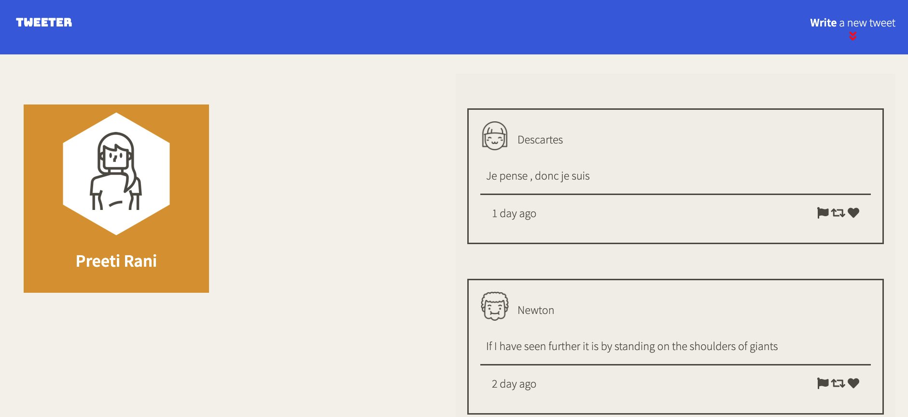
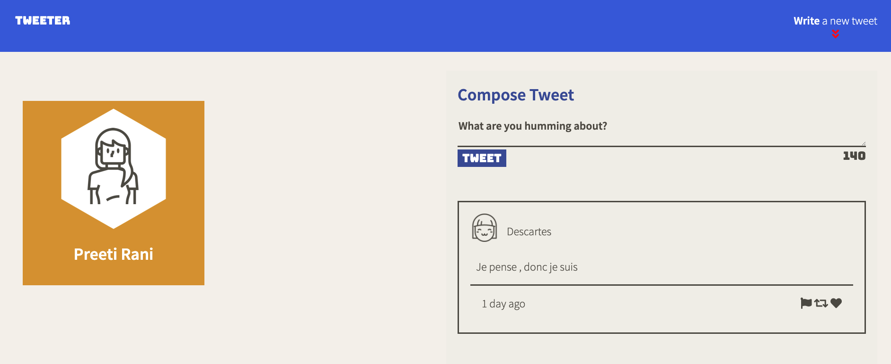
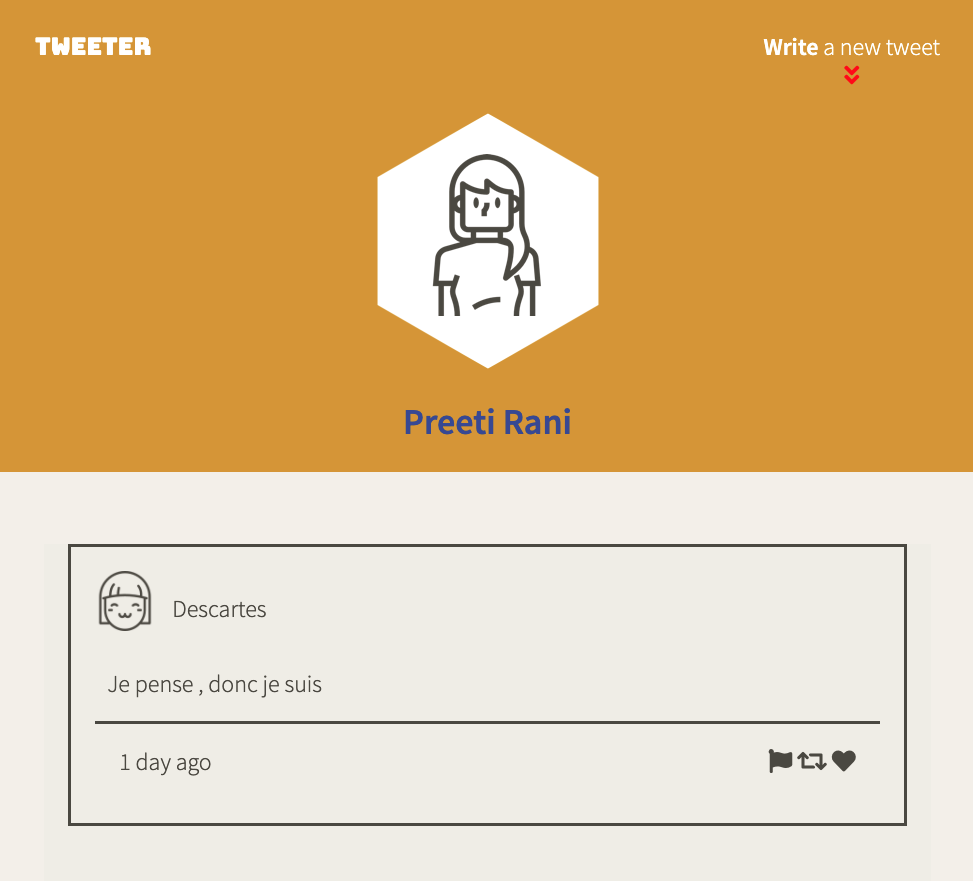

# Tweeter Project

Tweeter is a simple, single-page Twitter clone. It incules:

- Allow someone to see tweets posted in the past 
- Allow a user to write new tweets
- Includes responsive design for desktop, tablets and mobile devices. 

This repository is the starter code for the project: Students will fork and clone this repository, then build upon it to practice their HTML, CSS, JS, jQuery and AJAX front-end skills, and their Node, Express and MongoDB back-end skills.

## Final Product





## Dependencies

- Node.js
- body-parser
- Express
- chance
- SASS

## Getting Started

- Install all dependencies:
```npm install```

- Run the development web server:
`npm run local`

- Run the app on browser:
`http://localhost:8080`
